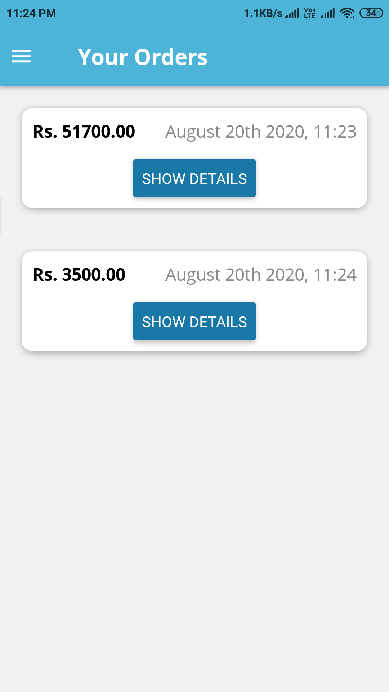
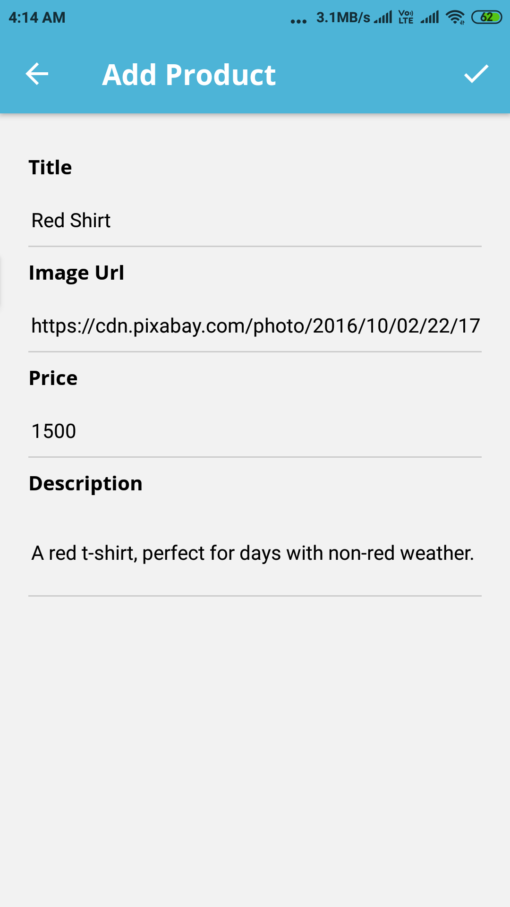
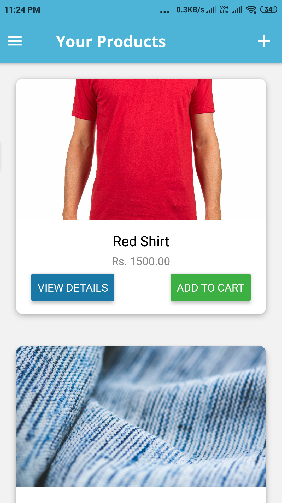

# Mobile-Shopping-App

**Shopping App having Cart Feature, Order History and User Authentication(with Signup, Auto Login & Logout).**

**Users can Shop from Catalogue of Products, Add them to Cart, Place Order and also view thier Previous Orders.**

**Users can also Add New Products to the Catalogue. They can also View, Edit and Delete Products Added By Them.**

**Users also get a Push Notification when thier Added Product is Ordered by any Other User.**

**Project is made with React Native on top of Expo and can run on both Android And IOS Platforms.**

**(Packages Used- Redux, Thunk, React-Native-Navigation. Google Firebase for Database and Authentication.)**

  

  

  

  
